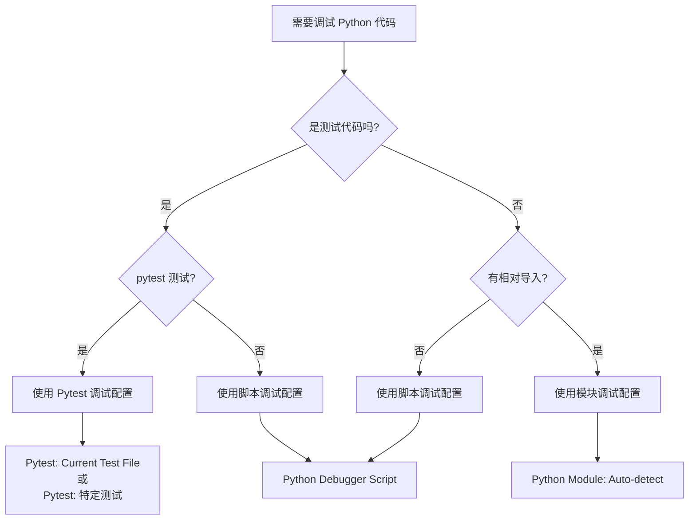

# Python 测试调试最佳实践指南 🧪

> **基于 Signal Protocol 项目的 VS Code 调试配置**

本文档详细说明了如何在 VS Code 中配置完整的 Python 测试调试环境，涵盖从脚本调试到模块测试的各种场景。

## 📋 目录

1. [调试配置概览](#调试配置概览)
2. [脚本调试模式](#1-脚本调试模式)
3. [模块调试模式](#2-模块调试模式)
4. [pytest 测试调试](#3-pytest-测试调试)
5. [输入变量配置](#4-输入变量配置)
6. [最佳实践](#最佳实践)
7. [故障排除](#故障排除)

## 🎯 调试配置概览

我们的 `launch.json` 实现了 **4种核心调试模式**，覆盖了 Python 开发中的所有常见测试场景：

```jsonc
{
    "version": "0.2.0",
    "configurations": [
        // 1️⃣ 直接脚本调试
        "Python Debugger Script: Current File",
        
        // 2️⃣ 智能模块调试
        "Python Module: Auto-detect Current File",
        
        // 3️⃣ pytest 当前文件调试
        "Pytest: Current Test File",
        
        // 4️⃣ pytest 特定测试调试
        "Pytest: Identity Key Tests"
    ]
}
```

## 1. 脚本调试模式 📄

### 配置详解

```jsonc
{
    "name": "Python Debugger Script: Current File",
    "type": "debugpy",
    "request": "launch",
    "program": "${file}",              // 直接执行当前文件
    "console": "integratedTerminal",   // 使用集成终端
    "justMyCode": false,              // 可以调试库代码
    "cwd": "${workspaceFolder}"       // 工作目录为项目根目录
}
```

### 适用场景

✅ **适合调试**:
- 独立的 Python 脚本
- 包含 `if __name__ == '__main__':` 的模块
- 数据处理脚本
- 工具脚本

### 使用示例

```python
# signal_protocol/keys/pre_keys/base_pre_key.py
if __name__ == '__main__':
    # 这部分代码可以用脚本调试模式调试
    print("Testing pre-key generation...")
    pre_key_pair = generate_pre_key_pair(1)
    print(f"Generated: {pre_key_pair.key_id}")
```

**调试流程**:
1. 打开 `base_pre_key.py`
2. 在要调试的行设置断点
3. 按 `F5` → 选择 "Python Debugger Script: Current File"
4. 程序直接执行文件中的 `__main__` 部分

## 2. 模块调试模式 🔧

### 配置详解

```jsonc
{
    "name": "Python Module: Auto-detect Current File",
    "type": "debugpy",
    "request": "launch",
    "module": "${input:currentFileModule}",  // 动态转换文件路径为模块路径
    "console": "integratedTerminal",
    "justMyCode": false,
    "cwd": "${workspaceFolder}"
}
```

### 智能路径转换

这是该配置的**核心创新**，通过 `inputs` 配置实现自动路径转换：

```jsonc
"inputs": [
    {
        "id": "currentFileModule",
        "type": "command", 
        "command": "extension.commandvariable.transform",
        "args": {
            "text": "${relativeFileDirname}/${fileBasenameNoExtension}",
            "find": "/",          // 查找路径分隔符
            "replace": ".",       // 替换为模块分隔符
            "flags": "g"          // 全局替换
        }
    }
]
```

### 路径转换示例

| 文件路径 | 自动转换为模块路径 |
|---------|------------------|
| `signal_protocol/keys/identity_key.py` | `signal_protocol.keys.identity_key` |
| `signal_protocol/keys/pre_keys/base_pre_key.py` | `signal_protocol.keys.pre_keys.base_pre_key` |
| `tests/test_identity_key.py` | `tests.test_identity_key` |

### 适用场景

✅ **适合调试**:
- 需要通过 `python -m` 执行的模块
- 有相对导入的模块
- 包中的子模块
- 需要正确模块上下文的代码

### 使用示例

```python
# signal_protocol/keys/pre_keys/signed_pre_key.py
from ..identity_key import IdentityKeyPair  # 相对导入
from .base_pre_key import PreKeyPair        # 相对导入

if __name__ == "__main__":
    # 这种有相对导入的模块必须用模块调试模式
    identity_key_pair = generate_identity_key_pair()
```

**调试流程**:
1. 打开 `signed_pre_key.py`
2. 按 `F5` → 选择 "Python Module: Auto-detect Current File"
3. 系统自动转换为 `python -m signal_protocol.keys.pre_keys.signed_pre_key`
4. 正确处理相对导入

## 3. pytest 测试调试 🧪

### 通用测试文件调试

```jsonc
{
    "name": "Pytest: Current Test File",
    "type": "debugpy",
    "request": "launch", 
    "module": "pytest",                    // 使用 pytest 模块
    "justMyCode": false,
    "console": "integratedTerminal",
    "cwd": "${workspaceFolder}",
    "args": [
        "${file}",                         // 当前打开的测试文件
        "-v",                             // 详细输出
        "-s"                              // 不捕获输出，允许 print
    ]
}
```

### 特定测试文件调试

```jsonc
{
    "name": "Pytest: Identity Key Tests",
    "type": "debugpy", 
    "request": "launch",
    "module": "pytest",
    "justMyCode": false,
    "console": "integratedTerminal",
    "cwd": "${workspaceFolder}",
    "args": [
        "tests/test_identity_key.py",     // 硬编码特定测试文件
        "-v",
        "-s"
    ]
}
```

### pytest 参数详解

| 参数 | 作用 | 说明 |
|------|------|------|
| `-v` | `--verbose` | 显示详细的测试结果 |
| `-s` | `--no-capture` | 不捕获输出，允许 `print()` 和 `pdb` |
| `--tb=short` | 简短回溯 | 减少错误信息的冗余 |
| `-x` | 遇到第一个失败就停止 | 快速定位问题 |
| `-k "test_name"` | 运行匹配的测试 | 选择性测试 |

### 适用场景

✅ **Pytest 当前文件调试**:
- 正在编写的测试文件
- 快速调试当前测试
- 不确定测试文件路径时

✅ **Pytest 特定文件调试**:
- 频繁调试的核心测试
- 回归测试
- CI/CD 流水线验证

### 测试调试示例

```python
# tests/test_identity_key.py
import unittest
from signal_protocol.keys import generate_identity_key_pair

class TestIdentityKey(unittest.TestCase):
    def test_key_generation(self):
        # 在这里设置断点
        identity_key_pair = generate_identity_key_pair()
        
        # 调试时可以检查变量
        self.assertEqual(len(identity_key_pair.public_key_bytes), 32)
        self.assertEqual(len(identity_key_pair.private_key_bytes), 32)
```

**调试流程**:
1. 在测试方法中设置断点
2. 选择对应的 pytest 调试配置
3. 在断点处检查变量状态
4. 单步执行验证逻辑

## 4. 输入变量配置 ⚙️

### Command Variable 扩展

我们的配置依赖 `rioj7.command-variable` 扩展：

```bash
# 安装命令
code --install-extension rioj7.command-variable
```

### 变量转换逻辑

```jsonc
{
    "id": "currentFileModule",
    "type": "command",
    "command": "extension.commandvariable.transform",
    "args": {
        "text": "${relativeFileDirname}/${fileBasenameNoExtension}",
        "find": "/",      // 文件系统路径分隔符
        "replace": ".",   // Python 模块分隔符  
        "flags": "g"      // 全局替换所有匹配项
    }
}
```

### VS Code 内置变量

| 变量 | 含义 | 示例 |
|------|------|------|
| `${file}` | 当前文件绝对路径 | `/path/to/project/signal_protocol/keys/identity_key.py` |
| `${relativeFileDirname}` | 相对目录名 | `signal_protocol/keys` |
| `${fileBasenameNoExtension}` | 不含扩展名的文件名 | `identity_key` |
| `${workspaceFolder}` | 工作区根目录 | `/path/to/project` |

## 📚 最佳实践

### 1. 调试配置选择指南



### 2. 断点设置策略

```python
# ✅ 好的断点位置
def generate_pre_key_pair(key_id: int) -> PreKeyPair:
    public_key, private_key = generate_key_pair()  # 断点：检查密钥生成
    return PreKeyPair(key_id, public_key, private_key)  # 断点：检查对象创建

# ✅ 测试中的断点
def test_key_generation(self):
    key_pair = generate_identity_key_pair()  # 断点：检查生成结果
    
    # 断点：验证关键属性
    self.assertEqual(len(key_pair.public_key_bytes), 32)
```

### 3. 调试输出最佳实践

```python
# ✅ 使用 pytest -s 时的调试输出
def test_with_debug_output(self):
    print(f"🔍 开始测试密钥生成")  # 在 pytest -s 模式下可见
    
    key_pair = generate_identity_key_pair()
    print(f"✅ 生成密钥对: {key_pair.key_id}")
    
    assert len(key_pair.public_key_bytes) == 32
    print(f"🎯 测试通过")
```

### 4. 环境变量和路径管理

```jsonc
// 所有配置都使用一致的环境设置
{
    "console": "integratedTerminal",  // 统一使用集成终端
    "justMyCode": false,             // 允许调试第三方库
    "cwd": "${workspaceFolder}"      // 统一工作目录
}
```

## 🔧 故障排除

### 问题 1: 模块导入错误

**症状**: `ModuleNotFoundError: No module named 'signal_protocol'`

**解决方案**:
```jsonc
// 确保 cwd 设置正确
"cwd": "${workspaceFolder}"

// 确保在项目根目录启动 VS Code
// cd /path/to/Signal-Protocol
// code .
```

### 问题 2: 相对导入失败

**症状**: `ImportError: attempted relative import with no known parent package`

**解决方案**:
- 使用 "Python Module: Auto-detect Current File" 而不是脚本调试
- 确保 Command Variable 扩展已安装

### 问题 3: pytest 找不到测试

**症状**: `collected 0 items`

**解决方案**:
```python
# 确保测试文件名以 test_ 开头
# tests/test_identity_key.py ✅
# tests/identity_key_test.py ❌

# 确保测试类以 Test 开头
class TestIdentityKey(unittest.TestCase):  # ✅
    pass

# 确保测试方法以 test_ 开头  
def test_key_generation(self):  # ✅
    pass
```

### 问题 4: 断点不生效

**解决方案**:
```jsonc
// 确保 justMyCode 设置为 false
"justMyCode": false,

// 检查文件是否已保存
// 重新加载 VS Code 窗口
```

## 🎯 扩展配置示例

### 添加更多 pytest 配置

```jsonc
{
    "name": "Pytest: Pre-Key Tests", 
    "type": "debugpy",
    "request": "launch",
    "module": "pytest",
    "justMyCode": false,
    "console": "integratedTerminal",
    "cwd": "${workspaceFolder}",
    "args": [
        "tests/test_pre_key.py",
        "-v",
        "-s",
        "--tb=short"  // 简短的错误回溯
    ]
},
{
    "name": "Pytest: Fast Fail",
    "type": "debugpy", 
    "request": "launch",
    "module": "pytest",
    "justMyCode": false,
    "console": "integratedTerminal", 
    "cwd": "${workspaceFolder}",
    "args": [
        "tests/",
        "-x",         // 第一个错误就停止
        "--tb=line"   // 单行错误信息
    ]
}
```

### 添加性能分析配置

```jsonc
{
    "name": "Python: Profile Current File",
    "type": "debugpy",
    "request": "launch", 
    "module": "cProfile",
    "console": "integratedTerminal",
    "justMyCode": false,
    "cwd": "${workspaceFolder}",
    "args": [
        "-o", "profile_output.prof",  // 输出文件
        "${file}"                     // 当前文件
    ]
}
```

## 📖 总结

这个 `launch.json` 配置的优势：

1. **完整覆盖**: 涵盖脚本、模块、pytest 所有调试场景
2. **智能转换**: 自动文件路径到模块路径转换
3. **灵活配置**: 通用配置 + 特定配置的组合
4. **最佳实践**: 统一的环境设置和参数
5. **易于扩展**: 清晰的结构便于添加新配置

这套配置为 Python 项目提供了**生产级别的调试环境**，特别适合：
- 复杂的模块结构项目
- 需要频繁测试调试的项目  
- 团队协作的标准化开发环境

通过这种配置，开发者可以无缝地在不同调试模式之间切换，大大提高开发效率和调试体验。
